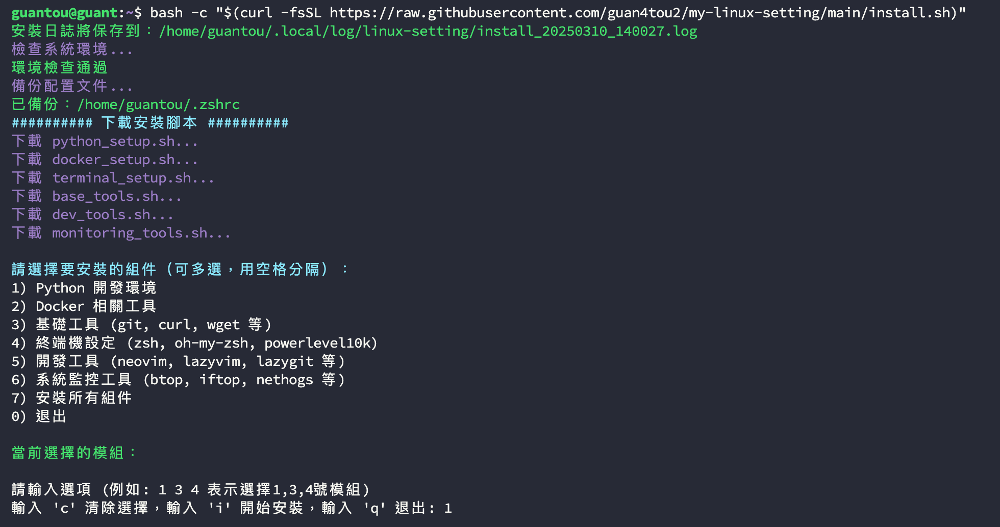

## Linux 環境設定腳本（增強版）

這是一套用來 **快速建立 Ubuntu / Debian 開發環境** 的安裝腳本，內建互動式選單、模組化安裝、錯誤回滾與詳細日誌，適合在新機、VM、WSL 或 CI 測試環境中快速複製一致的開發體驗。

### ✅ 主要特色

- **一行指令遠端安裝**（透過 `bash -c "$(curl ...)"`）
- **互動式選單**：自由選擇要安裝的模組
- **完整 Linux 開發環境**：Python / Docker / 終端 / 編輯器 / 監控工具
- **安全機制**：備份舊設定、失敗時可回滾
- **uv 為預設 Python 包管理器**，安裝/更新速度比 pip 快非常多

---

## 🚀 快速開始

### 標準安裝（推薦｜互動選單）

```bash
bash -c "$(curl -fsSL https://raw.githubusercontent.com/guan4tou2/my-linux-setting/main/install.sh)"
```

這個指令會：

- **直接從 GitHub 下載最新版本的 `install.sh`**
- 啟動 **互動式 TUI 選單**，讓你選擇要安裝的模組：
  - Python 環境
  - Docker 相關工具
  - 基礎工具
  - 終端機設定
  - 開發工具
  - 系統監控與安全工具

安裝完成後，你會得到一份簡單的安裝報告與備份/日誌位置說明。

---

## ⚙️ 指令列選項與參數

所有選項都可以在 **同一條 `bash -c "$(curl ...)"` 指令後面加參數** 來使用，例如：

```bash
# 最小安裝（僅安裝精簡必要工具，例如基礎工具等）
bash -c "$(curl -fsSL https://raw.githubusercontent.com/guan4tou2/my-linux-setting/main/install.sh)" --minimal

# 更新模式（只執行更新流程，不重新跑完整互動安裝流程）
bash -c "$(curl -fsSL https://raw.githubusercontent.com/guan4tou2/my-linux-setting/main/install.sh)" --update

# 詳細模式（啟用除錯用的詳細日誌）
bash -c "$(curl -fsSL https://raw.githubusercontent.com/guan4tou2/my-linux-setting/main/install.sh)" --verbose

# 顯示幫助說明（僅列出選項與說明，不執行安裝）
bash -c "$(curl -fsSL https://raw.githubusercontent.com/guan4tou2/my-linux-setting/main/install.sh)" --help
```

**目前支援的參數一覽：**

- `--minimal`：最小安裝模式，只安裝精簡必要工具
- `--update`：更新模式，執行 `update_tools.sh` 更新已安裝工具
- `-v` / `--verbose`：開啟詳細日誌與除錯輸出
- `-h` / `--help`：顯示安裝腳本的使用說明

> **備註**：如果你是 `git clone` 這個 repo 到本機，也可以直接在專案根目錄執行：`./install.sh [選項...]`，效果與上述遠端方式相同。

---

## 🧩 安裝模組一覽

安裝選單中提供以下模組（與 `install.sh` 內部實際模組相對應）：

- **1) Python 開發環境**

  - Python3 與相關工具：
    - `python3`, `pip`, `python3-venv`
    - `python3-dev`, `python3-setuptools`
    - `uv`（現代 Python 包管理器，預設包管理工具）
  - 終端輔助工具：
    - `ranger-fm`（終端檔案管理器）
    - `s-tui`（系統監控工具）

- **2) Docker 相關工具**

  - Docker 引擎與核心組件：
    - `docker-ce`, `docker-ce-cli`
    - `containerd.io`, `docker-buildx-plugin`
    - `docker-compose-plugin`
  - Docker 管理工具：
    - `lazydocker`

- **3) 基礎工具**

  - 系統基礎工具：
    - `git`, `curl`, `wget`, `unzip`, `tar`
    - `build-essential`, `pkg-config`
  - 終端增強工具：
    - `lsd`（更好的 `ls`）
    - `bat`（更好的 `cat`）
    - `ripgrep`（更好的 `grep`）
    - `fd-find`（更好的 `find`）
    - `fzf`（模糊搜尋工具）

- **4) 終端機設定**

  - Shell 與主題：
    - `zsh`
    - `oh-my-zsh`
    - `powerlevel10k`
  - Zsh 插件：
    - `zsh-autosuggestions`
    - `zsh-syntax-highlighting`
    - `zsh-history-substring-search`
    - `you-should-use`

- **5) 開發工具**

  - 編輯器與 Git 介面：
    - `neovim`（搭配 LazyVim 設定）
    - `lazygit`
  - 開發相關環境：
    - `nodejs`, `npm`
    - `cargo`（Rust 包管理器）
    - `lua`, `luarocks`

- **6) 系統監控與安全工具**

  - 系統資源監控：
    - `btop`, `htop`
  - 網路監控：
    - `iftop`, `nethogs`
  - 安全相關：
    - `fail2ban`

- **7) 安裝所有模組**
  - 等同於依照內建順序安裝：`base → dev → python → terminal → monitoring → docker`

---

## 📸 安裝畫面預覽



---

## 🧪 測試與開發流程

### 本地測試腳本

```bash
# 執行所有測試（建議在改動腳本後跑一次）
./tests/run_all_tests.sh

# 單獨測試
./tests/test_dependencies.sh    # 依賴檢查（如 apt / curl / sudo 等）
./tests/test_functionality.sh   # 功能測試（模組是否能正確執行）

# 預覽實際會套用的配置
./scripts/preview_config.sh
```

### Docker 測試環境

```bash
# 快速測試（build + test）
./docker-test.sh build && ./docker-test.sh test

# 多系統測試
docker-compose -f docker-compose.test.yml up ubuntu-test
docker-compose -f docker-compose.test.yml --profile legacy up ubuntu20-test
docker-compose -f docker-compose.test.yml --profile debian up debian-test

# 自動化測試（CI 情境）
docker-compose -f docker-compose.test.yml --profile test up test-runner

# 使用本機程式碼模擬「遠端安裝 + 互動選單」（推薦）
./tests/test_full_simulation.sh
# 這會在本機啟動一個 HTTP server，Docker 容器內透過 curl 抓取目前專案裡的 install.sh，
# 並自動輸入安裝選單（預設安裝：Python / 基礎工具 / 終端機 / 開發工具 / 監控工具，略過 Docker），
# 用來驗證「最新本機程式碼」的實際安裝流程。
```

---

## 🛠️ 系統管理腳本

以下是安裝完成後常用的維護腳本：

- **健康檢查**

  ```bash
  ./scripts/health_check.sh
  ```

- **更新所有工具**

  ```bash
  ./scripts/update_tools.sh
  ```

- **測試所有安裝腳本**

  ```bash
  # 基本腳本測試
  ./tests/test_scripts.sh

  # 完整測試套件
  ./tests/run_all_tests.sh

  # Docker 環境測試
  ./docker-test.sh build     # 建立測試映像
  ./docker-test.sh test      # 執行測試
  ./docker-test.sh full-test # 完整安裝測試
  ```

---

## 🧾 TUI 顯示模式（安裝輸出）

安裝腳本內建兩種輸出模式，可透過環境變數 `TUI_MODE` 控制：

- `quiet`（預設）：只顯示關鍵步驟與成功/失敗結果，隱藏 `apt` 的詳細輸出
- `normal`：顯示完整的安裝與 `apt` 輸出（適合除錯或第一次觀察安裝內容）

範例（本機已 clone 專案時）：

```bash
# 預設安靜模式（不用特別設定）
./install.sh

# 切換為完整輸出模式
TUI_MODE=normal ./install.sh --verbose
```

同樣也可以搭配遠端安裝用法（例如）：

```bash
TUI_MODE=normal bash -c "$(curl -fsSL https://raw.githubusercontent.com/guan4tou2/my-linux-setting/main/install.sh)" --verbose
```

---

## 📁 重要檔案與配置位置

- **Shell / 終端**

  - zsh 設定檔：`~/.zshrc`
  - powerlevel10k：`~/.p10k.zsh`

- **編輯器 / 開發工具**

  - neovim 設定：`~/.config/nvim`

- **Python / 虛擬環境**
  - 系統工具虛擬環境（由 `python_setup.sh` 建立）：`~/.local/venv/system-tools`
  - Python 套件由 **uv** 管理，預設會安裝在使用者目錄下（非系統全域）

---

## 💾 備份與日誌

為了避免破壞你原本的設定，安裝腳本在動手前會先：

- **備份舊設定**

  - 備份目錄：`~/.config/linux-setting-backup/`
  - 每次安裝會建立一個時間戳目錄，例如：  
    `~/.config/linux-setting-backup/20250310_123456/`

- **記錄安裝日誌**

  - 日誌位置：`~/.local/log/linux-setting/`
  - 檔名格式：`install_YYYYMMDD_HHMMSS.log`

- **錯誤時的回滾機制**
  - 發生錯誤時會詢問你是否要 **回滾到安裝前的狀態**
  - 回滾會從備份目錄還原設定檔（例如 `~/.zshrc`、`~/.p10k.zsh`、`~/.config/nvim` 等）

---

## 🔬 內部技術與最佳實務

- **包管理與 Python**

  - 使用 **uv** 作為主要 Python 包管理器（比 pip 快 10–100 倍）
  - 自動檢查 Python 版本，不符合時會嘗試以 `apt` 安裝 `python3` / `python3-venv` 等

- **錯誤處理與安全性**

  - 強化錯誤處理（`set -eE` + 自訂 `trap`）
  - 詳細的錯誤日誌與行號提示
  - 網路檢查／磁碟空間檢查
  - sudo 權限檢查

- **使用者體驗**
  - 互動式 TUI 選單
  - 彩色輸出與狀態訊息
  - 安裝報告（顯示安裝了哪些模組、設定檔與日誌位置）

---

## 🔧 若你想 fork / 客製化此專案

如果你 fork 了這個 repo，只要修改 `install.sh` 裡的 `REPO_URL` 即可讓遠端安裝指令指向自己的 GitHub：

```bash
export REPO_URL="https://raw.githubusercontent.com/{github name}/{repo name}/main"
```

之後即可使用你自己的遠端安裝指令，例如：

```bash
bash -c "$(curl -fsSL https://raw.githubusercontent.com/<your-name>/<your-repo>/main/install.sh)"
```

其他腳本（例如 `scripts/*.sh`、`tests/*.sh`）都會自動跟著 `REPO_URL` 做調整，不需要額外改動。
