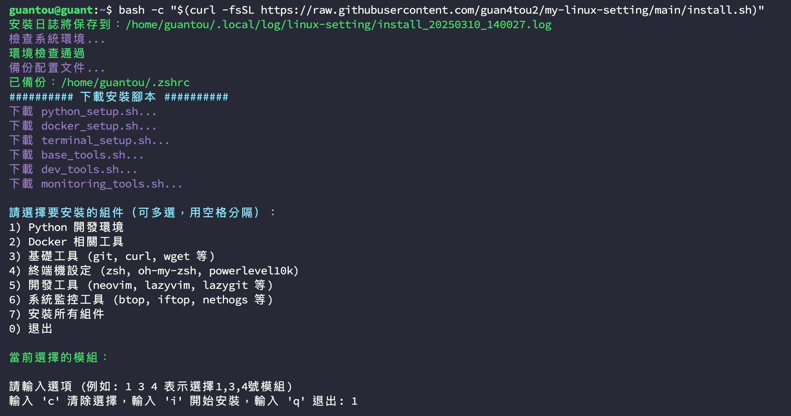

## Linux 環境設定腳本

快速建立多種 Linux 發行版開發環境的自動化安裝腳本，支援互動式選單、模組化安裝、錯誤回滾與詳細日誌。

### 🐧 支援的 Linux 發行版

- **Debian 系列**：Ubuntu、Debian、Kali Linux、Linux Mint、Pop!_OS、Elementary OS
- **RHEL 系列**：Fedora、CentOS、RHEL、Rocky Linux、AlmaLinux
- **Arch 系列**：Arch Linux、Manjaro、EndeavourOS、Garuda Linux
- **SUSE 系列**：openSUSE、SLES（基本支援）

腳本會自動檢測系統並使用對應的包管理器（apt、dnf、yum、pacman、zypper）。

### ✅ 主要特色

- 一行指令遠端安裝
- 自動檢測並適配不同 Linux 發行版
- 互動式選單自由選擇模組
- 完整開發環境：Python / Docker / 終端 / 編輯器 / 監控工具
- 自動備份與失敗回滾機制
- 使用 uv 作為預設 Python 包管理器

---

## 🚀 快速開始

### 標準安裝（推薦）

```bash
bash -c "$(curl -fsSL https://raw.githubusercontent.com/guan4tou2/my-linux-setting/main/install.sh)"
```

啟動互動式選單，選擇要安裝的模組（Python、Docker、基礎工具、終端機、開發工具、監控工具）。

---

## ⚙️ 指令列選項

```bash
# 最小安裝
bash -c "$(curl -fsSL https://raw.githubusercontent.com/guan4tou2/my-linux-setting/main/install.sh)" --minimal

# 更新模式
bash -c "$(curl -fsSL https://raw.githubusercontent.com/guan4tou2/my-linux-setting/main/install.sh)" --update

# 預覽模式
bash -c "$(curl -fsSL https://raw.githubusercontent.com/guan4tou2/my-linux-setting/main/install.sh)" --dry-run

# 詳細模式
bash -c "$(curl -fsSL https://raw.githubusercontent.com/guan4tou2/my-linux-setting/main/install.sh)" --verbose
```

**參數說明：**

- `--minimal`：最小安裝模式
- `--update`：更新已安裝工具
- `--dry-run`：預覽將要安裝的內容
- `-v / --verbose`：顯示詳細日誌
- `-h / --help`：顯示幫助訊息

### 性能優化選項

透過環境變數控制性能優化功能：

```bash
# 停用並行安裝（預設啟用）
ENABLE_PARALLEL_INSTALL=false ./install.sh

# 調整並行任務數（預設 4）
PARALLEL_JOBS=8 ./install.sh
```

**優化功能：**

- 並行安裝：同時安裝多個套件（提升速度約 30%）
- APT 優化：自動配置 APT 並行下載與快取（提升速度約 20%）

---

## 🧩 安裝模組

- **Python 開發環境**：python3, pip, uv, ranger-fm, s-tui
- **Docker 工具**：docker-ce, docker-compose, lazydocker
- **基礎工具**：git, curl, wget, lsd, bat, ripgrep, fd-find, fzf
- **終端機設定**：zsh, oh-my-zsh, powerlevel10k, zsh-autosuggestions, zsh-syntax-highlighting
- **開發工具**：neovim (LazyVim), lazygit, nodejs, cargo, lua
- **監控與安全**：btop, htop, iftop, nethogs, fail2ban

---

## 📸 安裝畫面預覽



---

## 🧪 測試與開發

### 本地測試

```bash
./tests/run_all_tests.sh          # 測試入口（依賴/功能測試僅 Linux CI 預設執行）
./tests/test_dependencies.sh      # 依賴檢查
./tests/test_functionality.sh     # 功能測試
./scripts/preview_config.sh       # 預覽配置
```

```bash
FORCE_LINUX_TESTS=true ./tests/run_all_tests.sh   # 本機強制執行 Linux-only 測試
```

### Docker 測試

```bash
./docker-test.sh build && ./docker-test.sh test    # 快速測試
docker-compose -f docker-compose.test.yml up ubuntu-test    # 多系統測試
./tests/test_full_simulation.sh                             # 完整模擬測試
```

---

## 🛠️ 系統維護

```bash
./scripts/health_check.sh    # 健康檢查
./scripts/update_tools.sh    # 更新工具
./uninstall.sh               # 卸載腳本
```

---

## 🧾 顯示模式

透過 `TUI_MODE` 環境變數控制輸出詳細程度：

- `quiet`（預設）：只顯示關鍵步驟
- `normal`：顯示完整安裝輸出

```bash
TUI_MODE=normal ./install.sh --verbose
```

---

## 📁 重要檔案位置

- Shell：`~/.zshrc`, `~/.p10k.zsh`
- Neovim：`~/.config/nvim`
- Python 虛擬環境：`~/.local/venv/system-tools`

---

## 💾 備份與日誌

- 備份目錄：`~/.config/linux-setting-backup/`
- 日誌位置：`~/.local/log/linux-setting/`
- 錯誤時自動詢問是否回滾

---

## 🔬 技術特點

- 使用 uv 作為 Python 包管理器（比 pip 快 10-100 倍）
- 強化錯誤處理與詳細日誌
- 自動檢查網路、磁碟空間、sudo 權限
- 互動式選單與彩色輸出

---

## 🔧 客製化

Fork 此專案後，修改 `install.sh` 中的 `REPO_URL`：

```bash
export REPO_URL="https://raw.githubusercontent.com/<your-name>/<your-repo>/main"
```
